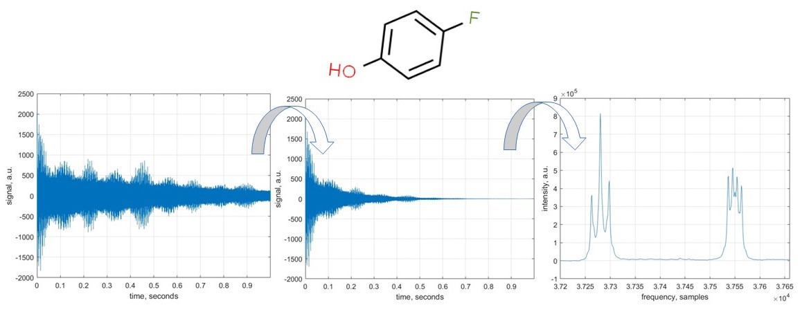

## 2. Initial processes on raw NMR data  

In this example, we import a sample NMR data and perform a few standard NMR data processing operations: DC offset correction, apodisation, zerofilling, and Fourier transform. 
The molecule we are dealing with is 4-fluorophenol, a common pharmaceutical precursor. Data kindly provided by Prof. Ilya Kuprov, University of Southampton.

### Usage

This code can be opened in [MATLAB® Online™](https://matlab.mathworks.com/).

